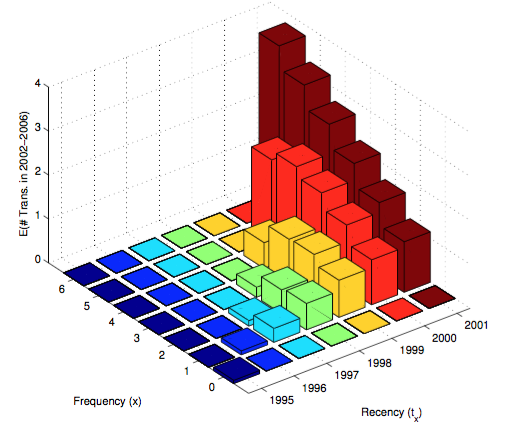

```{r setup, include = FALSE}
knitr::opts_chunk$set(echo = TRUE, message = FALSE, warning = FALSE, fig.align = 'center', size = 'small', fig.pos = 'H',
                      fig.width = 6, fig.height = 3.5)

knitr::knit_hooks$set(
          size = function(before, options, envir) {
                  if (before) return(paste0("\n \\", options$size, "\n\n"))
                  else return("\n\n \\normalsize \n")
                  }
          , inline = function(x) {if(!is.numeric(x)){ x }else{ prettyNum(round(x,2), big.mark=",") } }
          )
```

```{r report-load-packages, results = 'hide', include = FALSE}
pacman::p_load(tidyverse, forcats, pander, stringr, lubridate, ggrepel, extrafont, jrfTools)
```

```{r report-additional-setup, include = FALSE}
options(scipen=999)
panderOptions('digits', 8)
panderOptions('round', 4)
panderOptions('keep.trailing.zeros', TRUE)
```

# Question 1

We will use the "Regular" churn dataset from HW1:

```{r}
hw1_churn_data <- readxl::read_excel("Homework data.xlsx", sheet = 1, 
                                     col_names = c('year', 'regular', 'high_end','empty'), skip = 1)

regular_cust <- 
  hw1_churn_data %>%
  select(year, regular) %>%
  filter(complete.cases(.)) %>%
  rename(customers = regular)
```

```{r echo = FALSE}
regular_cust %>%
  pander(caption = "Regular Customers from HW1 Dataset")
```


## Parts a and b

```{r}
fn_st <- function(t, gamma, delta, c) {
  return(exp(lbeta(gamma, delta + t^c) - lbeta(gamma, delta)))
}

fn_ll <- function(par, data, type) {
    if (type == 'BdW') {
      c = par[3]
    } else {
      c = 1
    }
    
    data2 <- 
      data %>%
        mutate(
            lost = lag(customers) - customers
          , st = fn_st(t = year, par[1], par[2], c)
          , pt = lag(st) - st
          , ll = lost * log(pt)
        )
      
    ll <- sum(data2$ll, na.rm = TRUE) + log(1 - sum(data2$pt, na.rm = TRUE)) * 
            rev(data2$customers)[1]
    return(-ll)
}

fn_model <- function(data, type) {
  
  pars <- nlminb(start = c(1,1,1), fn_ll, lower = c(0, 0, 0), 
                 upper = c(Inf, Inf, Inf), data = data, type = type)$par
  return(
    data_frame(model = type ,gamma = pars[1], delta = pars[2], 
               c = if_else(type == "BdW", pars[3], NA_real_))
  )
  
}

seven_year <- 
  regular_cust %>%
  filter(year <= 7)

BdW_sBG_pars <- 
  fn_model(seven_year, type = "BdW") %>%
  bind_rows(fn_model(seven_year, type = "sBG")) %>%
  rowwise() %>%
  mutate(ll = -1 * fn_ll(par = c(gamma, delta, c), seven_year, model))
```

Using maximum likelihood estimation we fit a Beta-discrete-Weibull (BdW) and a shifted Beta-Geometric (sBG) model using the first 7-years as our training data. Below are the model parameters:

```{r echo = FALSE}
BdW_sBG_pars %>%
  pander(missing = "", caption = "Model Parameters using the first 7-years as training data", round = c(NA, 4, 4, 4, 2))
```

We see that the parameters $\gamma$ and $\delta$ are quite different between the BdW and the sBG model. Also, the fact that $c > 1$ means we have positive duration dependence, i.e. churn probability increases over time. The survival function for the sBG is the same as the BdW, with $c = 1$,

\begin{equation}
\ S(t|\gamma,\delta, c) = \frac{B(\gamma, \delta + t^c)}{B(\gamma, \delta)}
\end{equation}

Notably, the $\delta$ parameter is greater than 1, implying a very different type heterogeneity. We can see this is the different distributions of the mixing distribution beta. 

```{r}
BdW_sBG_pars %>%
  mutate(
    beta = map2(gamma, delta, function(.x, .y) {rbeta(100000, .x, .y)})
  ) %>%
  unnest() %>%
  ggplot(aes(x = beta, colour = model)) +
  geom_line(stat = "density") +
  theme_jrf(users_v = "rstudio") +
  labs(x = expression(theta), y = expression(f(theta)), colour = NULL, 
       title = "Estimated Beta Distributions of Theta") +
  scale_colour_manual(values = c(`BdW` = pal538[['blue']], `sBG` = pal538[['green']]))
```

In the plot above, we see that the shape of the heterogeneity is U-shaped: the density drops as $\theta$ increases and then increases again around $\theta = 0.75$. 

```{r}
BdW_sBG_curves <- 
  BdW_sBG_pars %>%
    crossing(year = regular_cust$year) %>%
    mutate(st = fn_st(t = year, gamma, delta, if_else(is.na(c), 1.0, c))) %>%
    select(year, model, st) %>%
    bind_rows(
      regular_cust %>%
        mutate(
            model = "Actual"
          , st = customers / max(customers)
        ) %>%
        select(-customers)
    ) %>%
    group_by(model) %>%
    mutate(rt = st / lag(st)) %>%
    ungroup()
```

In the survival curves below see nearly no difference between the two models (and the actual). To the right of the grey-line represents out-of-sample performance.

```{r}
BdW_sBG_curves %>%
  ggplot(aes(x = year, y = st, color = model)) +
  geom_vline(aes(xintercept = 7), alpha = 0.5) +
  geom_line() +
  scale_x_continuous(limits = c(0,12), expand = c(0.01, 0.01)) +
  scale_y_continuous(labels = scales::percent) +
  labs(x = "Year", y = "% Customers Surviving", title = "Survival Curve of BdW and sBG Models",
       subtitle = "Regular customers, 7-year holdout", color = NULL) +
  theme_jrf(users_v = "rstudio") +
  scale_colour_manual(values = c(`BdW` = pal538[['blue']], `Actual` = pal538[['red']], 
                                 `sBG` = pal538[['green']]))
```

There is slightly greater difference between the models in the retention curve. Though $c > 1$ for the BdW, the retention curve is not U-shaped. This indicates that the effect of heterogeneity swamps individual-level positive duration dependence to yield a monotonically increasing aggregate retention curve. 

```{r}
BdW_sBG_curves %>%
  ggplot(aes(x = year, y = rt, color = model)) +
  geom_vline(aes(xintercept = 7), alpha = 0.5) +
  geom_line() +
  scale_x_continuous(limits = c(0,12), expand = c(0.01, 0.01)) +
  scale_y_continuous(labels = scales::percent) +
  labs(x = "Year", y = "Retention Rate", title = "Retention Rate of BdW and sBG Models",
       subtitle = "Regular customers, 7-year holdout", color = NULL) +
  theme_jrf(users_v = "rstudio") +
  scale_colour_manual(values = c(`BdW` = pal538[['blue']], `Actual` = pal538[['red']], 
                                 `sBG` = pal538[['green']]))
```

We perform a likelihood ratio test (df = 1) and find that the additional parameter $c$ is not worth having in the model. We can say that duration dependence does not matter as much as heterogeneity.

```{r}
BdW_sBG_pars %>%
  select(model, ll) %>%
  spread(model, ll) %>%
  mutate(chisq = 2* (BdW - sBG)) %>%
  mutate(p.value = pchisq(chisq, df = 1, lower.tail = FALSE)) %>%
  gather(metric, `&nbsp;`) %>%
  pander(caption = "")
```

## Part c

```{r}
fn_derl <- function(data, renewals, d) {
  base <- (data %>% filter(year == renewals))$st
  
  data2 <- 
    data %>%
      mutate(
        st_given_n = if_else(year > renewals,  st / base, NA_real_)
        , disc = if_else(year > renewals, 1 / (1 + d)^(year - (renewals + 1)), NA_real_)
        , discounted_st_given_n = st_given_n * disc
      )
  
  derl <- sum(data2$discounted_st_given_n, na.rm = TRUE)
  return(derl)
}

rtl <- 
  BdW_sBG_pars %>%
    crossing(year = 0:1000) %>%
    mutate(st = fn_st(t = year, gamma, delta, if_else(is.na(c), 1.0, c))) %>%
    crossing(renewals = 0:7) %>%
    select(model, renewals, year, st) %>%
    group_by(model, renewals) %>%
    nest() %>%
    rowwise() %>%
    mutate(derl = fn_derl(data, renewals, 0.1)) %>%
    ungroup() %>%
    mutate(rlv = 100 * derl)
```


We compute the DERL for a customer who has renewed at $t = 0, 1, ..., 7$ times using the BdW and sBG model. We multiple the DERL by $100 to find the residual lifetime value (RVL). Below is a plot that compares the two models: 

```{r}
rtl %>%
  ggplot(aes(x = renewals, y = rlv, color = model)) +
  geom_line() +
  scale_x_continuous(limits = c(0,7), expand = c(0.01, 0.03), breaks = 0:7) +
  scale_y_continuous(labels = scales::dollar) +
  labs(x = "Renewals", y = "Residual Lifetime Value", 
       title = "Discounted Expected Residual Lifetime Value (RVL)",
       caption = "Renewal = $100, Discount Rate = 0.1 p.a.", color = NULL) +
  theme_jrf(users_v = "rstudio") +
  scale_colour_manual(values = c(`BdW` = pal538[['blue']], `sBG` = pal538[['green']]))
```

First, we see that predicted RLV increases dramatically with tenure. In other words, the longer they have stayed the more value they will be in the future. We see that the RVL for the BdW and the sBG is similar for 0 and 1 renewals, but different as the number of renewals increases. This can be attributed to the positive duration dependence in the BdW model, where at the individual-level the model indicates that the probability of churning increases over time (though heterogeneity swamps duration dependence. This implies that the remaining customers will be more valuable and hence have a higher RLV than predicted by the sBG which does not include duration dependence.

# Question 2

```{r}
donations <- readxl::read_excel("HW Donation Dataset.xlsx", sheet = 1, 
                                col_names = c('frequency', 'recency', 'donors'), skip = 3) %>%
              filter(complete.cases(.))
```

## Part a

```{r}
fn_bgbb_ll <- function(alpha, beta, gamma, delta, x, tx, n) {
  constant <- exp(lbeta(alpha + x, beta + n - x) - lbeta(alpha, beta)) * 
                exp(lbeta(gamma, delta + n) - lbeta(gamma, delta))
  
  upper_limit <- n - tx - 1
  
  summation <- 0
  if (upper_limit >= 0) {
    for (i in 0:upper_limit) {
      summation <- summation + 
        exp(lbeta(alpha + x , beta + tx - x + i) - lbeta(alpha, beta)) * 
        exp(lbeta(gamma + 1, delta + tx + i) - lbeta(gamma, delta))
    }
  }
  
  ll <- log(constant + summation)
  return(ll)
}

fn_bgbb_optim <- function(par, data, n) {
  
  data2 <- 
    data %>%
    rowwise() %>%
    mutate(ll = donors * fn_bgbb_ll(par[1], par[2], par[3], par[4], x = frequency, 
                                    tx = recency, n = n))
  
  return(-sum(data2$ll))
}

fn_bgbb_model <- function(data, n) {
  
  pars <- nlminb(start = c(1,1,1,1), fn_bgbb_optim, lower = c(0, 0, 0, 0), 
                 upper = c(Inf, Inf, Inf, Inf), data = data, n = n)$par
  return(
    data_frame(model = "BG/BB", alpha = pars[1], beta = pars[2], gamma = pars[3], delta = pars[4])
  )
  
}

bgbb_params <- fn_bgbb_model(donations, n = 11)
```

We fit a BG/BB model to donations dataset using all 11 years of repeat donation data. We estimate the following model parameters using maximum likelihood:

```{r echo = FALSE}
bgbb_params %>%
  pander(caption = "BG/BB Esimated Model Parameters")
```

```{r}
fn_bgbb_px <- function(alpha, beta, gamma, delta, x, n) {
  constant <- choose(n, x) * 
                exp(lbeta(alpha + x, beta + n - x) - lbeta(alpha, beta)) * 
                exp(lbeta(gamma, delta + n) - lbeta(gamma, delta))
  
  upper_limit <- n - 1
  
  summation <- 0
  if (upper_limit >= x) {
    for (i in x:upper_limit) {
      summation <- summation + choose(i, x) *
          exp(lbeta(alpha + x, beta + i - x) - lbeta(alpha, beta)) * 
          exp(lbeta(gamma + 1, delta + i) - lbeta(gamma, delta))
    }
  }
  return(constant + summation)
}
```

```{r}
histogram_data <- 
  donations %>%
    group_by(frequency) %>%
    summarise(Actual = sum(donors)) %>%
    crossing(bgbb_params) %>%
    rowwise() %>%
    mutate(px = fn_bgbb_px(alpha, beta, gamma, delta, x = frequency, n = 11)) %>%
    ungroup() %>%
    mutate(Predicted = sum(Actual) * px) %>%
    select(frequency, Actual, Predicted) %>%
    gather(type, value, -frequency)
```

We then create an in-sample actual vs predicted histogram, which looks quite good:

```{r}
histogram_data %>%
  ggplot(aes(x = frequency, y = value, fill = type)) + 
  geom_bar(stat = 'identity', position = 'dodge') +
  labs(x = "# of Repeat Donations", y = "# of Donors", title = "In-Sample Histogram", fill = NULL) +
  scale_x_continuous(breaks = 0:11, minor_breaks = NULL) +
  scale_y_continuous(labels = scales::comma) +
  theme_jrf(users_v = "rstudio") +
  scale_fill_manual(values = c(`Actual` = pal538[['red']], `Predicted` = pal538[['blue']]))
```


```{r}
incremental_donations <- readxl::read_excel("HW Donation Dataset.xlsx", sheet = 3, 
                                col_names = c('year','donors'), skip = 1) %>%
              filter(complete.cases(.))

fn_bgbb_ex <- function(alpha, beta, gamma, delta, n) {
  ex <- (alpha / (alpha + beta)) * (delta / (gamma - 1)) * 
    (1 - exp(lgamma(gamma + delta) - lgamma(gamma + delta + n)) * 
       exp(lgamma(1 + delta + n) - lgamma(1 + delta)))
  return(ex)
}

incremental_data <- 
  bgbb_params %>%
  crossing(incremental_donations, total_donors = sum(donations$donors)) %>%
  rowwise() %>%
  mutate(ex = fn_bgbb_ex(alpha, beta, gamma, delta, year)) %>%
  ungroup() %>%
  mutate(
    cumulative_predicted = total_donors * ex
    , cumulative_actual = cumsum(donors)
    , incremental_predicted = cumulative_predicted - lag(cumulative_predicted, default = 0)
  ) %>%
  select(year, Actual = donors, Predicted = incremental_predicted) %>%
  gather(type, value, -year)
```

In addition, we build an incremental tracking plot that shows the number of repeat donations that occur in the years since the cohort first donated. While the predicted line is not perfect, it does follow the actual line quite closely.

```{r}
incremental_data %>%
  ggplot(aes(x = year, y = value, colour = type)) + 
  geom_line() +
  labs(x = "Year", y = "# of Repeat Donations", 
       title = "Incremental Tracking Plot", colour = NULL) +
  scale_x_continuous(breaks = 1:11, minor_breaks = NULL) +
  scale_y_continuous(labels = scales::comma, limits = c(0, NA)) +
  theme_jrf(users_v = "rstudio") +
  scale_colour_manual(values = c(`Actual` = pal538[['red']], `Predicted` = pal538[['blue']]))
```

## Part b

```{r}
sample_donors <-
  data_frame(Donor = c("Bob","Mary","Sharmila","Ayako","Sara")
             , Frequency = c(11,7,9,2,0)
             , Recency = c(11,11,9,7,0)
             )

fn_bgbb_post_prob <- function(alpha, beta, gamma, delta, x, tx, n, next_n) {
  exp(lbeta(alpha + x, beta + n - x) - lbeta(alpha, beta)) *
    exp(lbeta(gamma, delta + next_n) - lbeta(gamma, delta)) *
    1 / exp(fn_bgbb_ll(alpha, beta, gamma, delta, x, tx, n))
}

fn_bgbb_ex_n <- function(alpha, beta, gamma, delta, x, tx, n, n_star) {
  1 / exp(fn_bgbb_ll(alpha, beta, gamma, delta, x, tx, n)) *
    exp(lbeta(alpha + x + 1, beta + n - x) - lbeta(alpha, beta)) *
    (delta / (gamma - 1)) * exp(lgamma(gamma + delta) - lgamma(1 + delta)) *
    (exp(lgamma(1 + delta + n) - lgamma(gamma + delta + n)) - 
       exp(lgamma(1 + delta + n + n_star) - lgamma(gamma + delta + n + n_star)))
}

sample_donors_predictions <- 
  sample_donors %>%
    crossing(bgbb_params) %>%
    rowwise() %>%
    mutate(
      `Posterior Prob Alive at End of Year 11` = fn_bgbb_post_prob(alpha, beta, gamma, delta, 
                                      x = Frequency, tx = Recency, n = 11, next_n = 11)
      , `Expected # Donations in Next 10 Years` = fn_bgbb_ex_n(alpha, beta, gamma, delta, 
                                      x = Frequency, tx = Recency, n = 11, n_star = 10)
      ) %>%
    select(-model, -alpha, -beta, -gamma, -delta)
```

In the table below, we show for the sample donors

1. The posterior probability of being alive at the end of Year 11
2. The expected number of donations each donor will make over the next 10 years

```{r, echo = FALSE}
sample_donors_predictions %>%
  pander(caption = "Posterior Probability and Expected # of Future Donations", split.cells = 20)
```

The predictions for Bob and Mary make sense - they have donated in the last period and thus their expected number of donations are much higher than the 3 other donors. The surprising donor is Sharmila who has donated 9 times but has not donated in 2 periods. Her expected number of donations is below Ayako, who donated even longer ago and only twice. This demonstrates that the relationship that lower frequency, when recency is not extremely recent, produces high expected future transactions. It is the relationship shown below:

```{r out.width = '35%', echo = FALSE}

```
